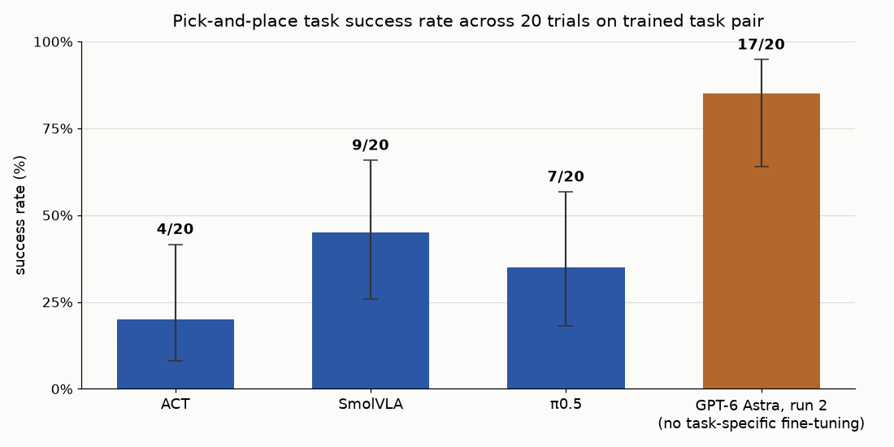
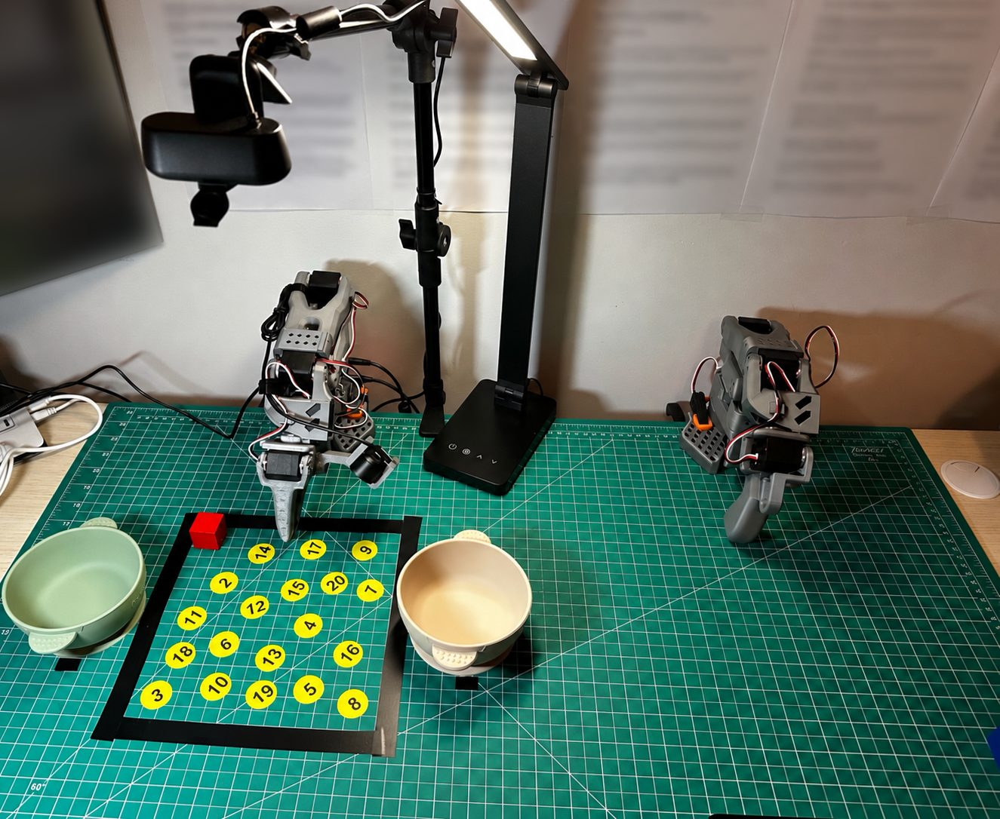

# robotics

Robotics experiments, results, and setup notes, with write-ups on Substack. The first project tests robot
policies on an SO-101 arm using [LeRobot](https://github.com/huggingface/lerobot). Planned work includes simulation,
transfer between robot bodies, and reinforcement learning.

**Substack**

| # | Post | What it covers | Where the work is |
|---|---|---|---|
| 0 | [Teaching a Robot to Pick Up a Block](https://timzwu.substack.com/p/teaching-a-robot-to-pick-up-a-block) (Sept 14, 2026) | ACT vs SmolVLA vs π0.5 on one pick-and-place task, a data-scaling curve, a camera ablation, Real-Time Chunking, and GPT-6 Astra with no demonstrations | [`experiments/`](experiments/) |

## 0 · Three generations of robot policy on one task



| Model | Task demonstrations | Success (20 trials) | 95% interval |
|---|---|---|---|
| ACT (from scratch) | 100 teleop demonstrations | 4 / 20 | 8–42% |
| SmolVLA (fine-tuned) | 100 teleop demonstrations | 9 / 20 | 26–66% |
| π0.5 (fine-tuned, whole model) | 100 teleop demonstrations | 7 / 20 | 18–57% |
| GPT-6 Astra (no fine-tuning, run 2) | None | 17 / 20 | 64–95% |

Same task, 20 block positions, and 30 s of arm motion per trial, excluding inference pauses. Astra used a different
control interface and about 100 s of thinking per trial. This comparison includes differences in control and compute. See [`experiments/README.md`](experiments/README.md)
for the six questions, protocol, and results.

## The rig



SO-101 follower arm plus leader arm for teleoperation; two 640×480 cameras, overhead and wrist; mat
with 20 numbered sticker positions and a bowl on each side. Evaluation is 20 trials at fixed positions, 30 s of motion
each. Trials are scored by the furthest stage reached: no contact, contact without grip, grip without placement,
or success.

## Layout

| Path | What |
|---|---|
| [`experiments/`](experiments/) | Post #0: the scripts (`tools/`), one folder per experiment under `results/` with its README, CSVs, charts and reels, and the cross-cutting files (`training_runs.md`, `all_trials_wk1.csv`). |
| [`notes/setup.md`](notes/setup.md) | Environment and hardware setup on macOS, reasons for each choice. |
| [`scripts/`](scripts/) | Shell wrappers for long commands (teleop). |
| `sim/` (later) | The Isaac Lab work, with its own environment. |

Trial footage: the final reels are in git; the raw per-trial videos are not.

## Setup

Training runs on [Modal](https://modal.com); teleoperation, recording and evaluation run on the Mac connected to the arm.

```bash
conda create -y -n lerobot python=3.12 && conda activate lerobot
conda install -y -c conda-forge ffmpeg
pip install 'lerobot[core_scripts,feetech]==0.6.1' modal
```

Then follow [`experiments/README.md`](experiments/README.md) for recording, training, serving a checkpoint and evaluating.
Camera indices and arm ports live in [`experiments/tools/robot.json`](experiments/tools/robot.json).
