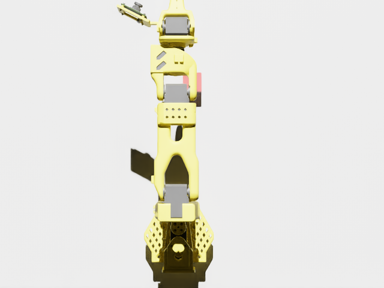
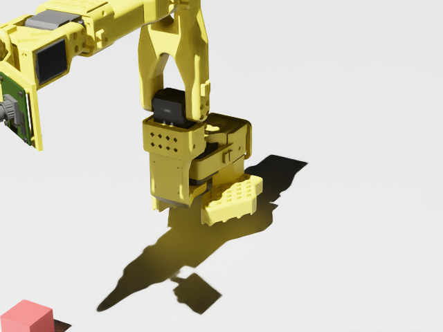

# 01 · Isaac Sim pipeline check

Step 1 of the sim-to-real plan (`../README.md`): can I render the SO-101 in Isaac Sim, headless, on a rented GPU, from a
script I run from my laptop? Sept 14, 2026.

**Result: yes.** One Lambda Cloud A6000 (~$1.09/h), Isaac Sim 5.1 inside NVIDIA's `isaac-lab:2.3.2` container, the
workshop's SO-101 model (45 prims) in an empty scene with a falling block. The block settles on the ground (physics),
and both cameras return a rendered frame (graphics).

| check | value |
|---|---|
| robot prims loaded | 45 |
| block height before / after 120 physics steps | 0.100 m / 0.015 m (resting on the ground) |
| overhead frame | 640×480, pixel std 40.5 |
| wall time inside the container | 33 s (image cached; a cold start took 127 s of shader compile) |
| session cost | ~30 min of A6000 ≈ $0.55, four failed runs included |

 

Files: `smoke.json` (the checks above, written by the script), `so101_frame.png` (overhead), `so101_frame_side.png`.
Scripts: `../tools/lambda_vm.py` (launch / status / terminate), `../tools/vm_setup.sh` (runs on the VM),
`../tools/isaac_smoke_so101.py` (runs inside the container). How it went, including the four things that broke first:
`methods.md`.
