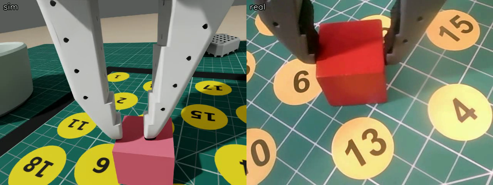

# 02 · The scene, and a real episode replayed in it

Step 2 of the sim-to-real plan: build the real rig in Isaac Lab and check it against the real cameras and a real
trajectory before recording any simulated demonstrations. Sept 14–15, 2026.

**Result.** The scene (`../so101_blocks/`) renders the mat, tape square, 20 numbered stickers, both bowls and the blocks
from an overhead and a wrist camera at the real dataset's 640×480. Real episode 0's joint trajectory replayed on the
simulated arm tracks within ~1° per joint. The first replay closed the gripper 4.6 cm beyond the block; 49 real grasps
showed the error was the pixel-to-world map, not the arm model; four tape measurements fixed it (the tape square is
24 cm, not the 20 cm I had assumed).

| check | value |
|---|---|
| joint tracking, RMS per joint (pan, lift, elbow, wrist, roll, gripper) | 0.05 / 0.7 / 0.9 / 0.8 / 1.2 / 0.9 ° |
| fingertip height at 49 real grasps (model, replayed joints) | 6 ± 5 mm above the mat |
| reach error, first map / measured map | +42 mm / +3 mm (spread 8 mm) |
| fingertip-to-block distance at the grasp, 3 replayed episodes with the measured map | 0.4–1.6 cm |
| gripper: real reading closed on the 2.5 cm block → model gap | 11.4 → 2.6 cm |
| session cost | ~2 h 10 min of A6000 ≈ $2.40 |

Still estimated rather than measured: overhead camera height, bowl height, block size, wrist camera mount, mat size. `methods.md` has the table, the joint and gripper unit mapping, the commands and what broke.
