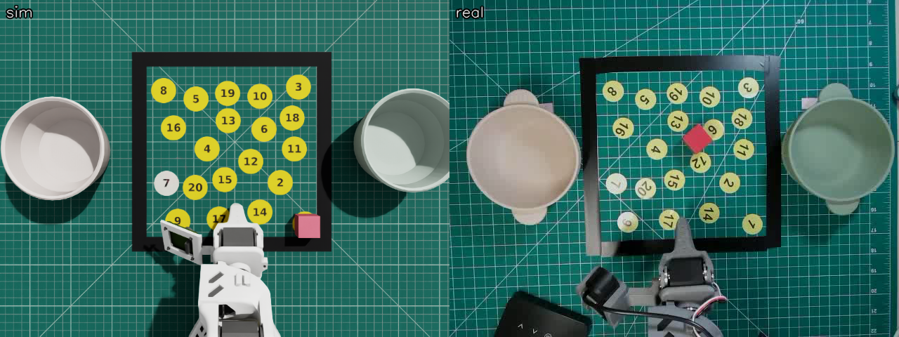
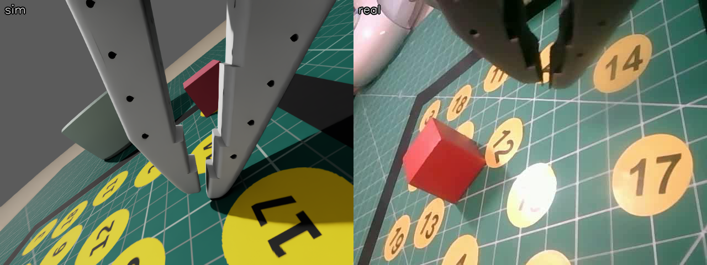

# Scene calibration

I recreated the real tabletop in Isaac Lab: SO-101, mat, two bowls, blocks, and overhead and wrist
cameras at 640×480. Replaying real joint commands tested the geometry and camera alignment.

| Check | Result |
|---|---|
| Joint tracking | 0.05–1.2° RMS error per joint in the first replay |
| Gripper alignment after calibration | Fingertips within 0.4–1.6 cm of the block across three replays |
| Successful replayed grasps | 0/3 |

Tape measurements corrected the initial pixel-to-world mapping. The resulting views and trajectories
aligned closely, but none of the three replays lifted the block. Visual and joint alignment did not
establish reliable contact behavior. The subsequent demonstration script planned grasps from known
object positions in the simulator.

[Methods and measurements](methods.md) · [Scene code](../so101_blocks/) ·
[Overhead replay](replay_ep0_compare_top.mp4) · [Wrist replay](replay_ep0_compare_wrist.mp4)
