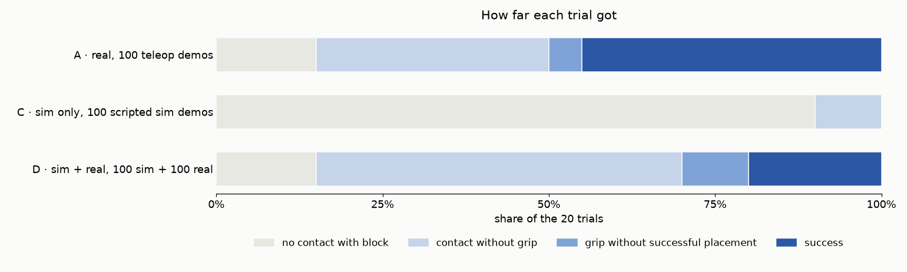
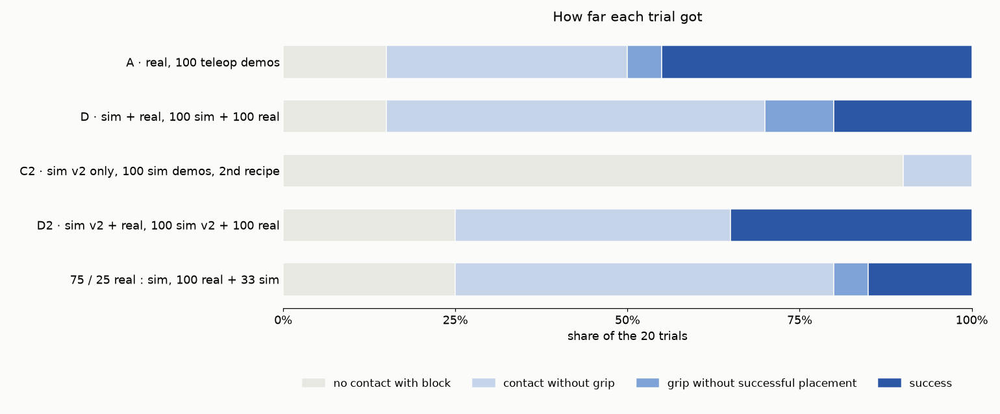

# 04 · Sim demonstrations on the real arm

The experiment: SmolVLA fine-tuned on real demonstrations (A), on simulated ones (C), or on both (D), evaluated on the
same 20 sticker positions on the real arm. Same model, same recipe (20k steps × 64), same task pair, same 30 s budget.
Sept 15, 2026.

**Result.** The first simulated demonstrations did not transfer, and adding them to the real ones hurt. Evaluated in the
simulator as well, no policy did the task there either: the sim-trained ones reach the block and never close on it,
the real-trained one cannot find it. The second sim recipe (`../05_sim_demos_v2/`) still did not transfer on its own,
but co-trained with the real demonstrations it recovered the real-only score.

| condition | trained on | real arm | in the simulator |
|---|---|---|---|
| A · real | 100 teleop demos | **9 / 20** (26–66%) | 0 / 20 (0–16%) |
| C · sim only | 100 scripted sim demos | **0 / 20** (0–16%) | 0 / 20 (0–16%) |
| D · sim + real | 100 sim + 100 real | **4 / 20** (8–42%) | 1 / 20 (1–24%) |
| C2 · sim v2 only | 100 scripted sim demos, second recipe (`../05_sim_demos_v2/`) | **0 / 20** (0–16%) | 2 / 20 (3–30%) |
| D2 · sim v2 + real | 100 sim v2 + 100 real | **7 / 20** (18–57%) | 4 / 20 (8–42%) |
| 75 / 25 · real : sim | 100 real + 33 sim (v1) | **3 / 20** (1–28%) | not run |

95% Wilson intervals; same 20 stickers, same stop-and-go loop, same 30 s budget in both worlds. On the arm: contact
A 17, C 2, D 17; closed on the block A 10, C 0, D 6. In the simulator: contact A 4, C 13, D 15; closed on the block
A 1, C 0, D 1.

Round 1 (A, C, D):

Round 2 (the second sim recipe and the 75 / 25 split, with A and D for reference):

Also: `success_by_condition{,_v2}.png`, `failure_geography_sim2real{,_v2}.png`.

**What the trials looked like on the arm** (my notes, `all_trials_sim.csv`). C went through the whole motion, reach, close, lift,
carry to the bowl, open, at a spot near the centre of the mat, in 18 of 20 trials without touching the block: it
learned the task's motion but not where the block is in a real image. D reached the block in 17 of 20 trials, as often as A, then
closed at a small offset or with the wrong wrist orientation and recovered at the same offset; twice it approached from
directly above, the sim agent's habit, and got stuck. Reels: `smolvla_sim_pair_10x.mp4`, `smolvla_simreal_pair_10x.mp4`.

**In the simulator** (`smolvla_*_simeval.csv`, scored from the physics). C and D go to the block, hover beside or
above it within a centimetre or two, and move on to the bowl without closing; D closed once and placed it. A, trained
only on real images, reaches into the zone but stops a few centimetres from the block in 16 of 20 trials: the same
failure as C on the arm, in the other direction. Reels: `smolvla_{sim,simreal,real}_simeval_10x.mp4`.

**C2 in the simulator** (Sept 16, `smolvla_sim_v2_simeval.csv`). The second sim recipe changed the failure, not yet
the score: C2 closed on the block and lifted it (2 trials, both placed; C never closed) but reached it less often,
contact 9 of 20 against C's 13, with 11 trials ending a few centimetres short. Its 2 / 20 is the gate for the real-arm
evals of C2, D2 and the 75 / 25 run. Reel: `smolvla_sim_v2_simeval_10x.mp4`.

**C2 on the arm** (Sept 16, `smolvla_sim_v2_pair.csv`): 0 / 20, contact 2, the same as C. In 18 trials it reached out
and closed at an offset from the block, at the centre of the mat or a few centimetres to one side of the block; twice it
touched the block and could not adjust. The second sim recipe changed what the policy does in its own simulator and
nothing about what it does on real images. No reel: nothing to see in 20 misses.

**D2 on the arm** (Sept 16, `smolvla_simreal_v2_pair.csv`): 7 / 20, red 3, blue 4; contact 15, closed on the block 7,
and every grip ended in the bowl (D: 17, 6, 4 of 6; A: 17, 10, 9 of 10). Several successes came after an adjustment or
a retry, one after dropping the block and picking it back up, which the v1 co-trained policy never managed; the misses
are still offsets and wrong wrist orientations at the block, and twice a straight-down approach pushed the block off the
mat. Reel: `smolvla_simreal_v2_pair_10x.mp4`.

**75 / 25 on the arm** (Sept 16, `smolvla_simreal_75_25_pair.csv`): 3 / 20, red 2, blue 1; contact 15, closed on the
block 3 (one grip ran out of time before the bowl). Between D (4 / 20) and nothing: a minority of v1 sim demonstrations
neither helped nor hurt beyond noise, and the misses look like D's, offsets and a straight-down approach that pushed
the block off the mat. No reel.

Files: the real-arm eval CSVs, the in-sim eval CSVs and per-trial JSON, `all_trials_sim.csv` (all 200 trials),
the charts for both rounds, the reels (round 1: five; round 2: C2 and D2 in the simulator, D2 on the arm). `methods.md` has the eval protocols, the fine-tune recipes and the reading.
