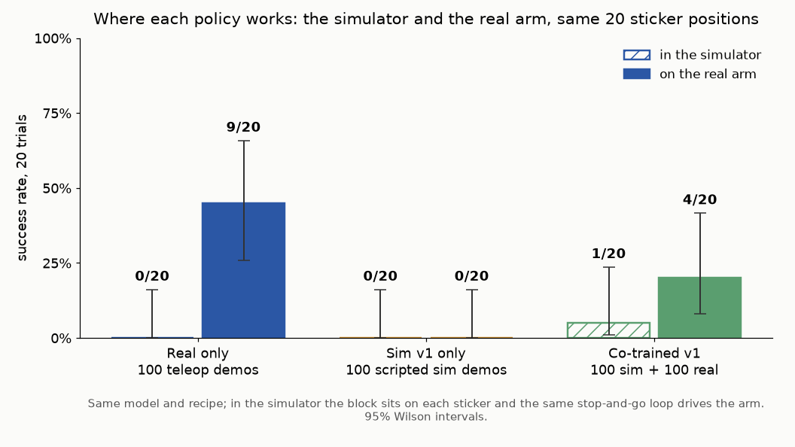
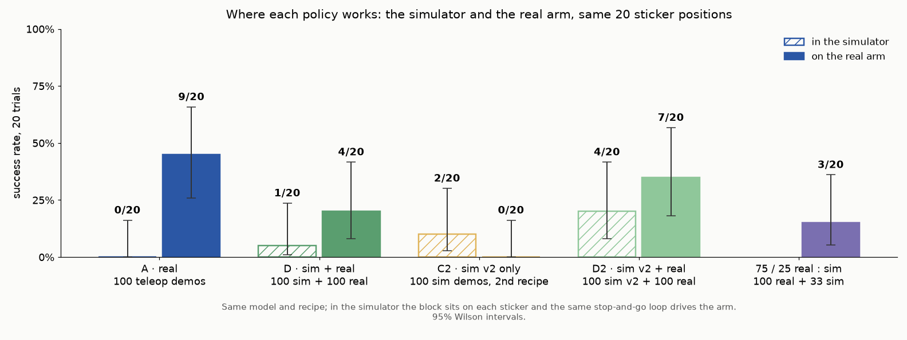

# Policy evaluations in simulation and on the real arm

Does simulated training data improve SmolVLA on the pick-and-place task? All policies started from
the same pretrained model and used 20,000 fine-tuning steps with batch size 64. Each evaluation used
20 marked block positions and 30 seconds of arm motion per trial, excluding inference pauses.

| Training data | Real arm | Simulator |
|---|---|---|
| Real only · 100 real | 9/20 (26–66%) | 0/20 (0–16%) |
| Sim v1 only · 100 sim | 0/20 (0–16%) | 0/20 (0–16%) |
| Co-trained v1 · 100 real + 100 sim v1 | 4/20 (8–42%) | 1/20 (1–24%) |
| Sim v2 only · 100 sim | 0/20 (0–16%) | 2/20 (3–30%) |
| Co-trained v2 · 100 real + 100 sim v2 | 7/20 (18–57%) | 4/20 (8–42%) |
| 75/25 real/sim · 100 real + 33 sim v1 | 3/20 (5–36%) | Not run |

Parentheses show 95% Wilson intervals. The real-only physical result comes from the
[original model comparison](../../experiments/results/01_model_comparison/).

## Results

- **Successful scripted demos did not produce reliable learned policies.** Sim-only v1 scored 0/20
  in both environments; sim-only v2 scored 2/20 in simulation and 0/20 on the arm.
- **Revised data improved co-training.** Physical success rose from 4/20 to 7/20, below the real-only
  9/20. All seven v2 trials that secured a grip ended in placement, including a drop-and-regrasp recovery.
- **Reducing the sim v1 share did not improve the score.** The 75/25 run scored 3/20, versus 4/20
  with equal numbers of real and sim v1 episodes.

The sim-trained policies struggled before transfer as well as after it. Sim v2 changed several data
features together, so these runs do not isolate which change contributed to the improvement.
Simulator evaluations used each sim version's mat appearance; intermediate grasp stages were scored
from physics proxies rather than the human labels used on the arm.

## Videos and data

- [Co-trained v2 on the physical arm and in simulation, 10×](smolvla_simreal_v2_real_and_sim_10x-publication-copy.mp4)
- [Sim-only v1 on the physical arm, 10×](smolvla_sim_pair_10x-publication-copy.mp4)
- [Co-trained v1 on the physical arm, 10×](smolvla_simreal_pair_10x-publication-copy.mp4)

[Methods](methods.md) · [All 220 trial outcomes](all_trials_sim.csv) ·
[Training log](../../experiments/results/training_runs.md) ·
[Real-arm stages, v1](stages_by_condition.png) · [Real-arm stages, v2](stages_by_condition_v2.png)
